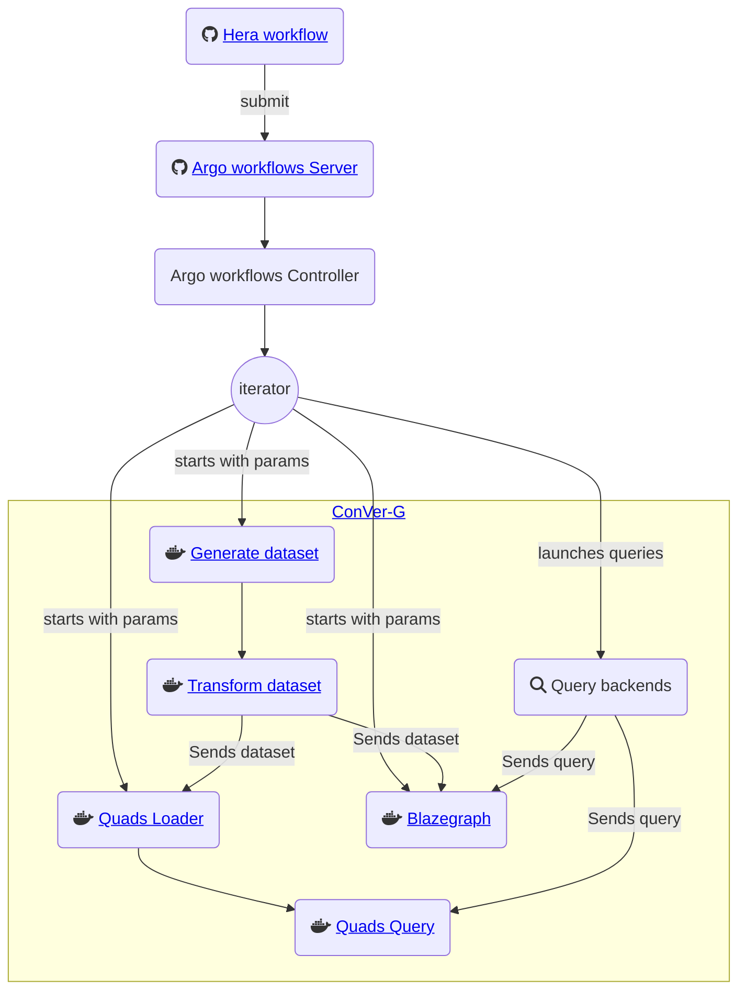

# UD-Demo-VCity-Knowledge_Evolution
Semantic, spatial and temporal knowledge

## Context
This work is part of the larger [Virtual City Project](https://projet.liris.cnrs.fr/vcity/) of LIRIS UMR 5205 CNRS and made possible thanks to a strong collaboration between LIRIS Laboratory and Metropole of Lyon.

The goal is about thinking about the amount of knowledge developed during the last decade and use it in a multidisciplinary context for understanding city evolution and its capacity to become more sustainable and resilient.

## Linked components

- [ConVer-G](https://github.com/VCityTeam/ConVer-G)
- [PostgreSQL](https://www.postgresql.org/docs/16/index.html)

### Kubernetes deployment
#### Deploy

```shell
export KUBE_DOCKER_REGISTRY=<your docker registry>
export KUBECONFIG=<your kubernetes config file>

# at the root of the project
kubectl apply -f ./kubernetes/conver-g
kubectl apply -f ./kubernetes/databases
```

#### Stop

```shell
# at the root of the project
kubectl delete -f ./kubernetes/conver-g
kubectl delete -f ./kubernetes/databases
```

### Minikube pods port forwarding

```shell
# Get access to the ud-quads-importer pod (http://localhost:8080)
kubectl port-forward services/ud-quads-importer 8080:8080

# Get access to the postgres pod (localhost:5432)
kubectl port-forward services/postgres 5432:5432
```

### Hera workflow
    
```shell
# print the help
python experiment.py --help

# execute the experiment
python experiment.py --versions 1 10 100 1000 --products 5 20 80 350 --variabilities 0 1 10 100
```



## Related Articles

- BDA 2023: [Graph versioning for evolving urban data](https://hal.science/hal-04257528)
- BDA 2024 [ConVer-G: Concurrent versioning of knowledge graphs](https://hal.science/hal-04690144)